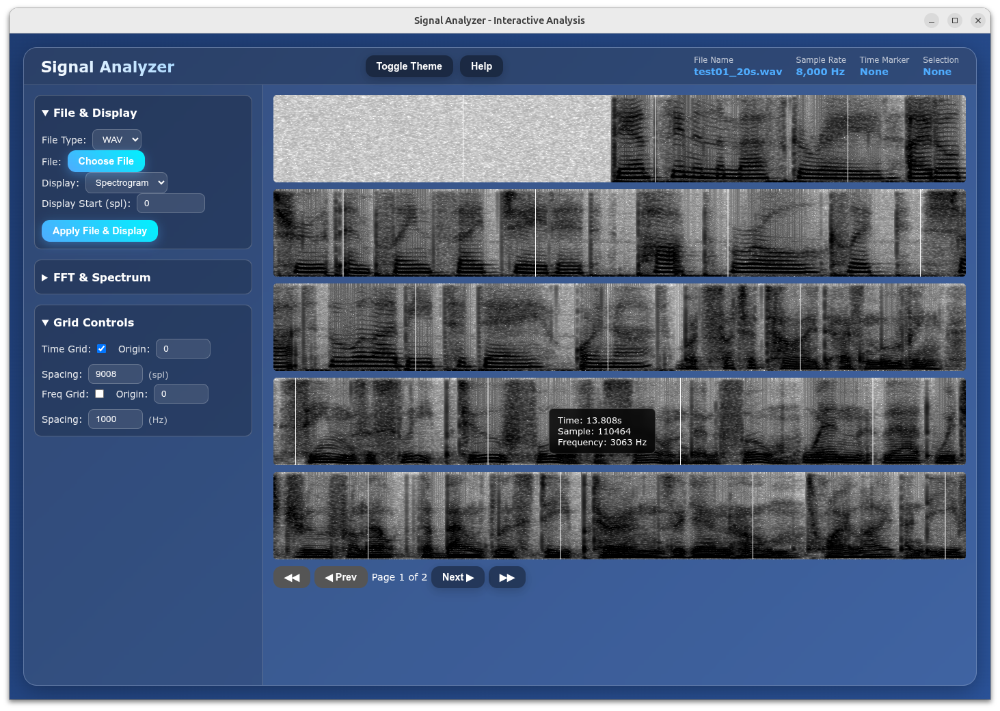

# SignalView

SignalView: An interactive web-based signal analyzer for visualizing audio waveforms and spectrograms with customizable FFT and display options.



## Table of Contents
- [About](#about)
- [Features](#features)
- [Getting Started](#getting-started)
  - [Prerequisites](#prerequisites)
  - [Running Locally](#running-locally)
- [How to Use](#how-to-use)
  - [Loading Files](#loading-files)
  - [Dual-File Mode](#dual-file-mode)
  - [Display Options](#display-options)
  - [FFT & Spectrum Controls](#fft--spectrum-controls)
  - [Grid Controls](#grid-controls)
  - [Interactive Features](#interactive-features)
  - [Keyboard Shortcuts](#keyboard-shortcuts)
  - [Theme Toggling](#theme-toggling)
  - [Help Dialog](#help-dialog)
- [Contributing](#contributing)
- [License](#license)

## About
SignalView is a powerful and intuitive web application designed for interactive analysis of audio signals.  
It allows users to load **one or two** WAV / raw audio files and visualize them as detailed spectrograms or waveforms.  
With a user-friendly interface featuring a left-hand control panel sidebar, you can easily adjust various parameters for FFT, spectrum display, and grid overlays to gain deep insights into your audio data.

## Features
- **File Loading:** Supports WAV and raw audio files with configurable sample rates and types for raw data.  
- **Dual-File Mode:** Load two files side-by-side for instant A/B comparison (spectrogram or waveform).  
- **Customizable FFT & Spectrum:**
    - Adjust FFT size, window type (Hann, Hamming, Blackman, Rectangle), and window length.
    - Select spectrum type (Magnitude, Log Magnitude, Power, Log Power, Squared Power).
    - Define dB range for spectrogram visualization.
    - Control hop length for spectrogram time resolution.
- **Interactive Grid Overlays:** Toggle and customize time and frequency grids with adjustable origin and spacing.
- **Zooming & Panning:** Navigate through large audio files with pagination controls.
- **Selection & Markers:**
    - Click and drag to create selections on the display.
    - Click to place a time marker.
    - Context menu (right-click) for selections and markers to perform actions like:
        - Show average power spectrum of a selection/marker in a draggable popup window.  
          – *NEW:* popup can display **both files together** (blue + orange curves) or **only the file you clicked on**.
        - Save selection as a WAV file.
        - Copy time/sample ranges or marker position.
        - Set grid origin or spacing from selection/marker.
- **Dynamic Information Display:** Real-time updates on file name, sample rate, marker position, and selection range.
- **Theme Switching:** Toggle between dark and light themes.
- **Responsive Design:** Optimized for various screen sizes.

## Getting Started

### Prerequisites
You only need a modern web browser to run SignalView. No backend server or complex setup is required.

### Running Locally
1.  **Clone the repository:**
    ```bash
    git clone https://github.com/PaulW-NZ/SignalView.git
    cd SignalView
    ```
2.  **Open `index.html`:**
    Simply open the `index.html` file in your web browser. You can do this by double-clicking the file or by navigating to its path in your browser (e.g., `file:///path/to/SignalView/index.html`).

## How to Use

The application interface is divided into a left sidebar for controls and a main content area for visualizations.

### Loading Files
1.  In the "File & Display" section of the sidebar, select "WAV" or "Raw" for "File Type".
2.  If "Raw" is selected, specify the "Raw SR" (Sample Rate) and "Raw Type" (e.g., 16-bit Signed).
3.  Click the "Choose File" button and select your audio file.
4.  Click **"Apply File & Display"** to load and render the file.

### Dual-File Mode
1.  After the **first** file is loaded, tick the **“Dual mode”** checkbox that appears under the file button.  
2.  A second **“Choose 2nd File”** button appears—use it to load the second file (WAV or raw, automatically re-sampled to match the SR of file 1).  
3.  Both traces are drawn **one above the other** with colour-coded labels.  
4.  Right-click on **either** trace to open the spectrum popup:
   - *“Show Power Spectrum – both files”* draws **two curves** (blue = file 1, orange = file 2).  
   - *“Show Power Spectrum – this file only”* draws **only the curve you clicked on**.

### Display Options
-   **Display Type:** Choose between "Spectrogram" and "Waveform" from the dropdown in the "File & Display" section.
-   **Amp Scale (Waveform only):** Adjust the amplitude scaling for the waveform display.
-   **Display Start (spl):** Manually set the starting sample for the display.

### FFT & Spectrum Controls (Spectrogram only)
These controls are available in the "FFT & Spectrum" section of the sidebar when "Spectrogram" is selected as the display type.
-   **FFT:** Select the FFT window size.
-   **Win:** Choose the windowing function (Hann, Hamming, Blackman, Rectangle).
-   **Win Length:** Set the length of the window.
-   **Colour:** Select a color scheme for the spectrogram.
-   **Spectrum:** Choose the type of spectrum to display (e.g., Log Power, Magnitude).
-   **dB Range:** Define the minimum and maximum decibel values for the spectrogram's color mapping.
-   **Hop:** Set the hop length (overlap) between successive FFT windows.
-   Click **"Apply FFT/Spectrum"** to apply changes.

### Grid Controls
Located in the "Grid Controls" section of the sidebar:
-   **Time Grid:** Toggle visibility, set origin (spl), and spacing (spl) for vertical time grid lines.
-   **Freq Grid (Spectrogram only):** Toggle visibility, set origin (Hz), and spacing (Hz) for horizontal frequency grid lines.

### Interactive Features
-   **Selection:** Click and drag on the main display to create a time-based selection.
-   **Time Marker:** Click on the display (without dragging) to place a single time marker.
-   **Context Menu (Right-Click):** Right-click on a selection or marker to access a context menu with options such as:
    -   **"Show Average Power Spectrum"**: Opens a draggable popup window displaying the power spectrum for the selected range or marker.  
        – *NEW:* popup also lets you **drag the frequency-grid lines** with the mouse to adjust origin & spacing visually.
    -   **"Save Selection as WAV..."**: Exports the selected audio segment as a new WAV file.
    -   **"Copy Time Range"** / **"Copy Sample Range"** / **"Copy Marker Position"**: Copies relevant information to your clipboard.
    -   **"Set Grid from Selection"** / **"Set Grid Origin from Marker"**: Adjusts grid parameters based on your interaction.
    -   **"Set Display Start Here"**: Changes the display's starting point to the marker's position.
-   **Pagination:** Use the **"◀◀"**, **"◀ Prev"**, **"Next ▶"**, **"▶▶"** buttons below the main display to navigate through the audio file in half-page or full-page increments.

### Keyboard Shortcuts
Press these keys **anywhere in the app** (except when typing in an input box):

| Key | Action |
|-----|--------|
| `S` | Toggle spectrogram visibility |
| `W` | Toggle waveform visibility |
| `D` | Toggle dual-file mode |
| `G` | Toggle time grid |
| `T` | Toggle dark / light theme |
| `←` | Nudge display left (big step) |
| `→` | Nudge display right (big step) |
| `Space` | *(reserved for future play/pause)* |

### Theme Toggling
Click the **"Toggle Theme"** button in the header to switch between dark and light themes.

### Help Dialog
Click the **"Help"** button in the header to open a dialog with an overview of the application and its features.

## Contributing
Contributions are welcome! If you have suggestions for improvements or new features, please open an issue or submit a pull request.

## License
This project is open-source and available under the [MIT License](LICENSE).

